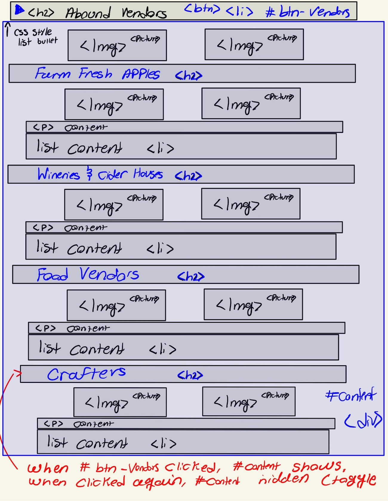

# Project 3: Design Journey

**For each milestone, complete only the sections that are labeled with that milestone.** Refine all sections before the final submission.

You are graded on your design process. If you later need to update your plan, **please do not delete the original plan, leave it in place and append your new plan _below_ the original.** Then explain why you are changing your plan. Any time you update your plan, you're documenting your design process!

**Replace ALL _TODOs_ with your work.** (There should be no TODOs in the final submission.)

Be clear and concise in your writing. Bullets points are encouraged.

**Everything, including images, must be visible in _Markdown: Open Preview_.** If it's not visible in the Markdown preview, then we can't grade it. We also can't give you partial credit either. **Please make sure your design journey should is easy to read for the grader;** in Markdown preview the question _and_ answer should have a blank line between them.


## Existing Project (Milestone 1)

**Tell us about the project you'll be using for Project 3.**

### Project (Milestone 1)
> Which project will you add interactivity to enhance the site's functionality?

Project 2


### Audience (Milestone 1)
> Briefly explain your site's audience.
> Be specific and justify why this audience is a **cohesive** group.

The audience that was identified at the Ithaca Harvest Festival was largely students who attend colleges nearby Ithaca. This may include but is most definitely not limited to Ithaca college, cornell, SUNY cortland, Elmira medical student, etc. These students have an understanding of upstate New York college life dynamics and communities thus are at the festival as more of a lesiure and entertainment activity. This is a cohesive audience as their goals all simulatneously align (lesiure and entertainment) and they come from a common, yet broad background as young adult students who are in college. Although exact goals may slightly vary, their biggest goal is to have fun and pursue entertainment and they all will look for information that fufils that in vendor items, performances and actual activites they can partake in. As students who are more so immersed in their respective collegiate community as opposed to the ithaca community, they still need to know information about the event such as hours, dates, parking, layout, etc.


### Audience's Goals (Milestone 1)
> List the audience's goals that you identified in Project 1 or 2.
> Simply list each goal. No need to include the "Design Ideas and Choices", etc.
> You may adjust the goals if necessary.

- What the Ithaca Harvest festival is all about and the cool, interest-piquing history of it.

- Specific details and information about getting to, navigating while their and managing time for the event

- Unique items, fun foods and merchandise they can buy at the festival

- Performances and unique events that they can enjoy at the festival


## Interactivity Design (Milestone 1)

### Interactivity Brainstorm (Milestone 1)
> Using the audience goals you identified, brainstorm possible options for interactivity to enhance the functionality of the site while also assisting the audience with their goals.
> Briefly explain each idea and provide a brief rationale for how the interactivity enhances the site's functionality for the audience.
> Note: You may find it easier to sketch for brainstorming. That's fine too. Do whatever you need to do to explore your ideas.

- The length of many pages ran rather long especially for mobile/low-width screens, which hindered a users ability to navigate the site and find relevant information in a timely manner. We can enhance the users experience in this case by collapsing the navigation bar so it does not inturrupt the pages content.

- The map on the event details page has very specific and detailed information that is very hard to see due to it's given dimensions on the screen. Users rely on critical details of the map to see where things are but it may be too small to see. Thus, we can allow the user to interact with the map and allow it to support a bigger, modal view.

- The vendors page can run a bit long and can be overbearing for the user since they have so much information present. We can tackle this problem by sectioning and collapsing vendor information so that the user can look at a specific section when helpful. This will allow the user to successfully navigate this page and find the item they're looking for with ease as well as enhance the website functionality in how it is laid out.


### Interactivity Design Ideation (Milestone 1)
> Explore the possible design solutions for the interactivity.
> Sketch several iterations of your interactivity.
> Annotate each sketch explaining what happens when a user takes an action. (e.g. When user clicks this, something else appears.)





### Final Interactivity Design (Milestone 1)
> Create _polished_ sketch(es) (it's still a sketch, but with a little more care taken to communicate ideas clearly to the graders) to plan your interactivity.
> **Sketch out the entire page where your interactivity will go.**
> Include your interactivity to the sketch(es).
> Add annotations to explain what happens when the user takes an action.
> Include as many sketches as necessary to communicate your design (ask yourself, could another 1300 take these sketches an implement my design?)


Sketch that reflects how I look to implement interactivity in my navigation bar so it can collapse and act like the hamburger design


Sketch that reflects how I look to implement interactivity for the map image and make it have a modal design


Sketch that reflects how I look to implement interactivity for the vendor items and give it the ability to collapse per section

### Interactivity Rationale (Milestone 1)
> Describe the purpose of your proposed interactivity.
> Provide a brief rationale explaining how your proposed interactivity addresses the goals of your site's audience.
> This should be about a paragraph. (3-5 sentences)

The primary purposes for my interactivity is to allow for more effective usability of my site primarily by tackling three specific issues. One of these issues is the overall length of each web page at low width screens, the second is the inability to see fine details and pertinent content of the map and the third is the abundance of information on the vendors page (which influences a large length issue as well). My proposed interactivity effectively counteracts these as it makes the navigation collapsable reducing length, the map more seeable by expanding it to a modal, and sectioning as well as collapsing vendor information so users can access specific sections. The collapsed navigation overall leads users to access information more specifically, including information relevant to their goals thus aids in addressing their goals. The expansion and modal of the map allows the users to finely see how the festival is laid out and where everything is, thus addressing the goal about accessing specific details and information about getting to and navigating the festival. The collapsing and sectioning of the vendors page allows the users to focus on a singular vendor type and easily access information about other vendor types at the click of a button, thus addressing the goal of figuring out about unique items, foods and merchandise at the festival.


## Interactivity Implementation Plan (Milestone 1)

### Interactivity Planning Sketches (Milestone 1)
> Produce planning sketches that include all the details another 1300 student would need to implement your interactivity design.


### Interactivity Pseudocode Plan (Milestone 1)
> Write your interactivity pseudocode plan here.
> Pseudocode is not JavaScript. Please do not put JavaScript code here.

Interactivity #1 (Navigation bar hamburger)

```
when #nav-btn clicked:
    if .hidden is not added to #pages:
        add .hidden to #pages
    else:
        remove .hidden from #pages
```

Interactivity #2 (map modal and expansion)

```
if #map-btn is clicked:
    add .modal to #map-btn
    remove .hidden from #exit
if #exit is clicked:
    remove .modal to #map-btn
    add .hidden from #exit
```

Interactivity #3 (collapsing vendor sections)

```
when #apples-btn clicked:
    if .hidden not added to #apples:
        add .hidden to #apples:
    else:
        remove .hidden from #apples
        add .hidden to #wine
        add .hidden to #food
        add .hidden to #craft

when #wine-btn clicked:
    if .hidden not added to #wine:
        add .hidden to #wine:
    else:
        remove .hidden from #wine
        add .hidden to #apples
        add .hidden to #food
        add .hidden to #craft

when #food-btn clicked:
    if .hidden not added to #food:
        add .hidden to #food:
    else:
        remove .hidden from #food
        add .hidden to #apples
        add .hidden to #wine
        add .hidden to #craft

when #craft-btn clicked:
    if .hidden not added to #craft:
        add .hidden to #craft:
    else:
        remove .hidden from #craft
        add .hidden to #apples
        add .hidden to #food
        add .hidden to #wine
```


### "Ambitious" Interactivity Explanation (Milestone 1)
> In your own words, concisely explain why you believe your interactivity meets the "ambitious" requirement.
> This should be a few sentences. (1-3 sentences)

I believe that my interactivity is ambitious as it will yield a considerable amount of technical design to ensure it works well. It will couple multiple methods of interactivity we learned in class and will effectively demonstrate a high level of adding JavaScript interactivity to the web browser


## Grading (Final Submission)

### Interactivity Usability Justification (Final Submission)
> Explain how your design effectively uses affordances, visibility, feedback, and familiarity.
> Write a large paragraph (4-6 sentences)


All my interactive designs employ a considerable amount of affordances. The hamburger navigation has a pointer cursor when a mouse is over it. Likewise, the image for the modal and X button once you are in the modal has the same pointer. The collapsing sections have this pointer as well. This showcases to the user that these buttons afford interaction to the item. Moreover, these items also carry a hover which showcases that the item can be interacted with and clicked on. This hover and pointer cursor provides affordances to the user. Moreover, these jointly impact feedback for the user as well as since the user does an operation, in this case hovers over, the items provide feedback to the user for doing an operation. I effectively implement feedback across my interactivity. For the navigation hamburger, when it is clicked, the button changes from a hamburger to a  3 dotted visual aka collapsed hamburger. This gives feedback to the user that the navigation is opened. This also follows for when you click the 3 dots and close it. Moreover, with the modal image, once it is clicked, a modal opens up. This change provides feedback to the user that the item has been interacted with and this is what occurs. This same idea follows for the X button. For my collpasing sections, when clicked, the section expands and the arrow goes from pointing left to pointing down to illustrate it is open. This gives a strong feedback to the user of what happens when interacted with. For visibility, my navigation hamburger becomes very apparent and is shown where the navigation generally is. Moreover, for the modal, the items are highly visible as it creates a sharp contrast between the modal item and the foreground content. The X item is also shaded different to show the contrast and that it can be used. For the collapsing item, the arrow is visible right next to the content and when it is clicked, the section becomes visible. All my designs are standard designs and very familiar to the user. The hamburger, kebab (collapsed hamburger), the X button on the modal, the arrows on the sections that point left when closed and down when opened are all very familiar concepts for the user.

### Tell Us What to Grade (Final Submission)
> We aren't re-grading your Project 1 or 2.
> We are only grading the interactivity you added.
> Tell us where (what pages) we can find your interactivity and how to use it.
> **We will only grade what you list here;** if it's not listed, we won't grade it.

Hamburger Interactivity - All pages, top left of page, generally where the navigation bar is. Right below the header. Website width must be below 800px for it to show.

Modal map - Event Details page. All the way at the bottom under the subheading "Event Map". The map itself serves as the interactivity

Collapsing Sections - The 4 sections at the bottom of the Vendors page. The sections themselves serve as the interactivity.


### Collaborators (Final Submission)
> List any persons you collaborated with on this project.

Nobody

### Reference Resources (Final Submission)
> Please cite any external resources you referenced in the creation of your project.
> (i.e. W3Schools, StackOverflow, Mozilla, etc.)

Mozilla Reference Documentation, W3Schools, GeeksForGeeks

### Self-Reflection (Final Submission)
> This was the first project in this class where you coded some JavaScript. What did you learn from this experience?

THis was a fun project. I liked employing JavaScript interactivity into the program. It made me feel like I had more control of how things on my website should be. It also felt very creative learning JavaScript and utilizing Event Driven Programming.


> Take some time here to reflect on how much you've learned since you started this class. It's often easy to ignore our own progress. Take a moment and think about your accomplishments in this class. Hopefully you'll recognize that you've accomplished a lot and that you should be very proud of those accomplishments!

It has been quite a long and strenous semester but it definitely has been worthwhile.The projects themselves have been pretty tough and I definitely do spend alot of time working on it but it teaches me alot. I feel that I've learned a significant amount in this couse and feel proud of the skills I have in Web Development. This class is really inspiring me to pursue it further as I really enjoy the creative aspects of it and creating cool, unique designs that satisfy users. I look forward to creating a great design and website in my Project 3 and I plan to learn more about the art of web development in info 2300!
